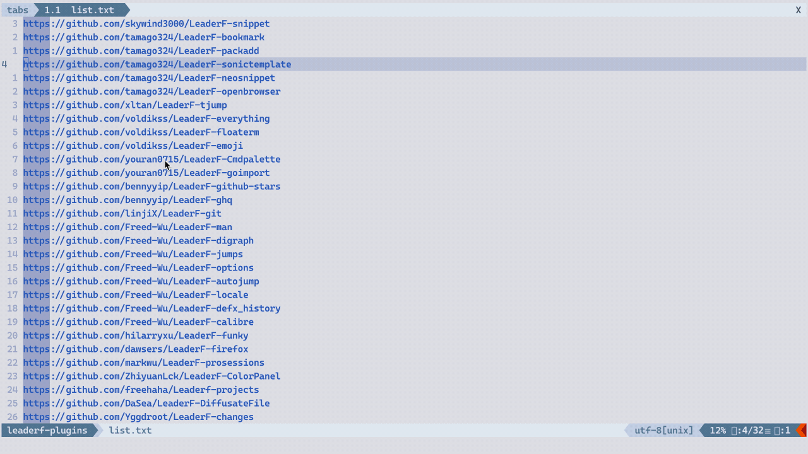

# LeaderF-folder

This plugin use [LeaderF](https://github.com/Yggdroot/LeaderF) to open a subfolder.



## Setup

This plugin takes [Dirbuf](https://github.com/elihunter173/dirbuf.nvim) as the default solution to open the chosen subfolder. You can use the following option to customize it:

```vim
let g:Lf_FolderAcceptSelectionCmd = 'Dirbuf'
```

## Usage

```vim
:LeaderfFolder
```

Press `F1` to get more help

## LICENSE

MIT
